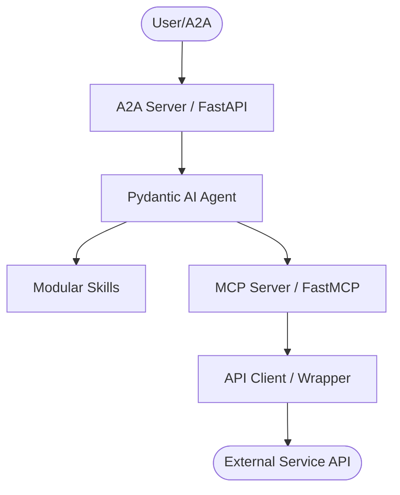
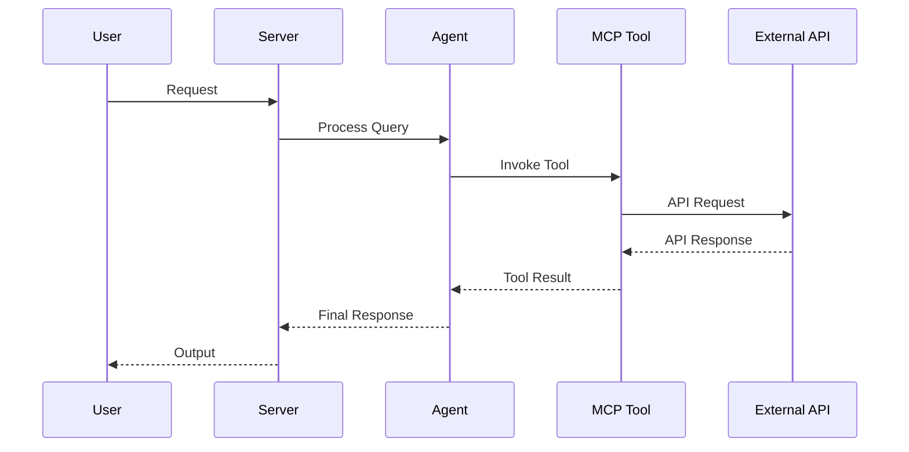
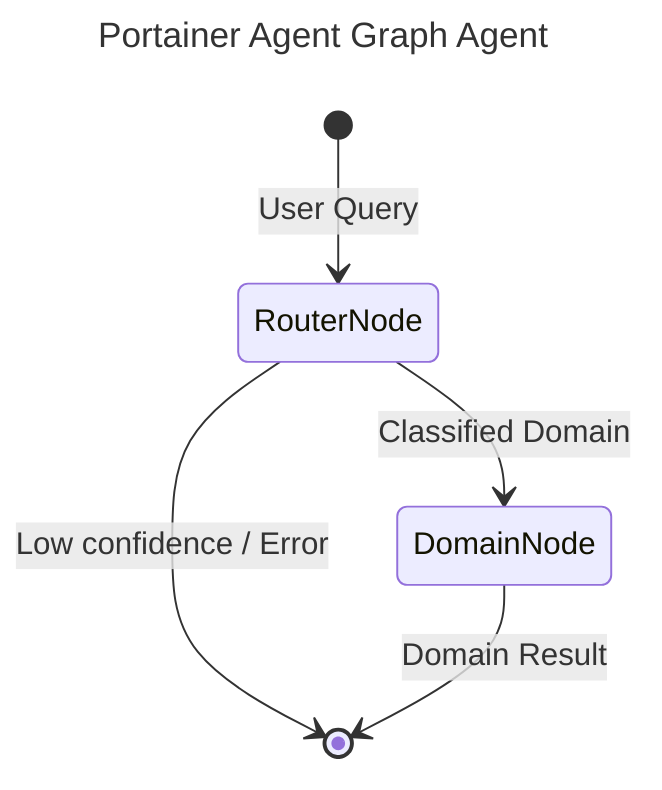

# AGENTS.md

## Tech Stack & Architecture
- Language/Version: Python 3.10+
- Core Libraries: `agent-utilities`, `fastmcp`, `pydantic-ai`
- Key principles: Functional patterns, Pydantic for data validation, asynchronous tool execution.
- Architecture:
    - `mcp_server.py`: Main MCP server entry point and tool registration.
    - `agent.py`: Pydantic AI agent definition and logic.
    - `skills/`: Directory containing modular agent skills (if applicable).
    - `agent/`: Internal agent logic and prompt templates.

### Architecture Diagram


### Workflow Diagram


## Build, Lint, and Test Commands

# Installation
pip install .[all]

# Development Setup
pip install -e .[dev]  # If dev dependencies are added

# Quality & Linting (run from project root)
pre-commit run --all-files

# Running Tests
# Run all tests
pytest

# Run a single test file
pytest tests/test_exact.py

# Run a specific test function
pytest tests/test_exact.py::test_exact_tool

# Run tests with coverage
pytest --cov=portainer_agent

# Run tests in verbose mode
pytest -v

# Run tests matching a pattern
pytest -k "stack"

# Run tests with specific markers
pytest -m "unit"

# Watch mode for test development
ptw .  # If pytest-watch is installed

# Execution Commands
# portainer-mcp
portainer_agent.mcp:mcp_server
# portainer-agent
portainer_agent.agent:agent_server

# Development server with reload
uvicorn portainer_agent.agent_server:app --reload  # If using FastAPI

## Project Structure Quick Reference
- MCP Entry Point → `mcp_server.py`
- Agent Entry Point → `agent.py`
- Source Code → `portainer_agent/`
- Skills → `skills/` (if exists)

### File Tree
```text
├── .bumpversion.cfg
├── .dockerignore
├── .env
├── .gitattributes
├── .gitignore
├── .pre-commit-config.yaml
├── AGENTS.md
├── Dockerfile
├── LICENSE
├── MANIFEST.in
├── README.md
├── compose.yml
├── debug.Dockerfile
├── portainer_agent
│   ├── __init__.py
│   ├── agent
│   │   ├── AGENTS.md
│   │   ├── CRON.md
│   │   ├── CRON_LOG.md
│   │   ├── HEARTBEAT.md
│   │   ├── IDENTITY.md
│   │   ├── MEMORY.md
│   │   ├── USER.md
│   │   └── mcp_config.json
│   ├── agent.py
│   ├── auth.py
│   ├── mcp_server.py
│   ├── portainer_api.py
│   └── skills
│       └── portainer-agent-docs
├── portainer_agent.egg-info
│   ├── PKG-INFO
│   ├── SOURCES.txt
│   ├── dependency_links.txt
│   ├── entry_points.txt
│   ├── requires.txt
│   └── top_level.txt
├── pyproject.toml
└── requirements.txt
```

## Code Style Guidelines

### Imports
- Use absolute imports from the project root
- Group imports: standard library, third-party, local
- Within each group, sort alphabetically
- Avoid wildcard imports
- Use `from __future__ import annotations` for type hints
- Import ordering example:
  ```python
  # Standard library
  import os
  import sys
  from typing import List, Optional, Dict

  # Third-party
  from pydantic import BaseModel
  import requests

  # Local
  from portainer_agent.auth import PortainerAuth
  from portainer_agent.portainer_api import PortainerAPI
  ```

### Formatting
- Line length: 88 characters (Black default)
- Use Black for code formatting
- Use Ruff for linting with strict settings
- Ensure files end with a newline
- No trailing whitespace
- Use 4 spaces per indentation level
- Maximum 2 blank lines between function/class definitions
- Maximum 1 blank line within function bodies

### Types
- Use type hints for all function parameters and return values
- Use Pydantic models for data validation
- Prefer specific types over `Any`
- Use `Optional[T]` for nullable values
- Use `List[T]`, `Dict[str, T]` for collections
- Use `TypedDict` for dictionary schemas with known keys
- Use `Literal` for finite sets of values

### Naming Conventions
- Functions and variables: snake_case
- Classes: CamelCase
- Constants: UPPER_SNAKE_CASE
- Private members: single leading underscore
- Descriptive names over abbreviations
- Avoid single letter names except in small loops
- Boolean variables: use is_/has_/can_ prefixes
- Functions returning bool: use is_/has_/can_ prefixes
- Exception classes: suffix with Error

### Error Handling
- Raise specific exceptions rather than generic Exception
- Use try/except blocks for expected error conditions
- Log errors with appropriate context using logging module
- Don't suppress exceptions without handling
- Use Pydantic validation for input data
- Return meaningful error messages to users
- Create custom exception classes for domain-specific errors
- Use exception chaining (raise ... from ...) when appropriate

## Dos and Don't's

**Do:**
- Run `pre-commit` before pushing changes.
- Use existing patterns from `agent-utilities`.
- Keep tools focused and idempotent where possible.
- Write descriptive docstrings for all tools (used as LLM tool descriptions).
- Check for optional dependencies using `try/except ImportError`.
- Follow the existing code style in the file you're editing.
- Write unit tests for new functionality.
- Update documentation when changing interfaces.

**Don't:**
- Use `cd` commands in scripts; use absolute paths or relative to project root.
- Add new dependencies to `dependencies` in `pyproject.toml` without checking `optional-dependencies` first.
- Hardcode secrets; use environment variables or `.env` files.
- Commit `.env` files or secrets.
- Modify `agent-utilities` or `universal-skills` files from within this package.
- Leave commented out code in the codebase.
- Use mutable default arguments in function definitions.

## Safety & Boundaries

**Always do:**
- Run lint/test via `pre-commit`.
- Use `agent-utilities` base classes.

**Ask first:**
- Major refactors of `mcp_server.py` or `agent.py`.
- Deleting or renaming public tool functions.
- Adding new public dependencies.

**Never do:**
- Commit `.env` files or secrets.
- Modify `agent-utilities` or `universal-skills` files from within this package.

## When Stuck
- Propose a plan first before making large changes.
- Check `agent-utilities` documentation for existing helpers.
- Look at similar implementations in the codebase.
- Run the tests to understand expected behavior.

## Graph Architecture

This agent uses `pydantic-graph` orchestration for intelligent routing and optimal context management.



- **RouterNode**: A fast, lightweight LLM (e.g., `nvidia/nemotron-3-super`) that classifies the user's query into one of the specialized domains.
- **DomainNode**: The executor node. For the selected domain, it dynamically sets environment variables to temporarily enable ONLY the tools relevant to that domain, creating a highly focused sub-agent (e.g., `gpt-4o`) to complete the request. This preserves LLM context and prevents tool hallucination.

## Additional Resources
- agent-utilities documentation: https://github.com/anomalyco/agent-utilities
- Pydantic AI documentation: https://ai.pydantic.dev/
- FastMCP documentation: https://github.com/jlowin/fastmcp
- Portainer API documentation: https://docs.portainer.io/api

## Cursor / Copilot Rules
No Cursor rules found in .cursor/rules/ or .cursorrules
No Copilot rules found in .github/copilot-instructions.md
