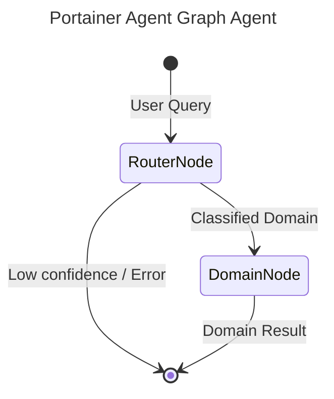

# Portainer Agent - A2A | AG-UI | MCP


*Version: 0.11.0*

## Overview

**Portainer Agent MCP Server + A2A Agent**

Agent package for Portainer container management — Docker environments, stacks, Kubernetes clusters, registries, users, and edge devices.

This repository is actively maintained - Contributions are welcome!

## MCP

### Using as an MCP Server

The MCP Server can be run in two modes: `stdio` (for local testing) or `http` (for networked access).

#### Environment Variables

*   `PORTAINER_URL`: The URL of the target Portainer service.
*   `PORTAINER_TOKEN`: The API token or access token.
*   `PORTAINER_SSL_VERIFY`: Verify SSL certificate (default: True).

#### Run in stdio mode (default):
```bash
export PORTAINER_URL="http://localhost:9000"
export PORTAINER_TOKEN="your_token"
portainer-mcp --transport "stdio"
```

#### Run in HTTP mode:
```bash
export PORTAINER_URL="http://localhost:9000"
export PORTAINER_TOKEN="your_token"
portainer-mcp --transport "http" --host "0.0.0.0" --port "8000"
```

## A2A Agent

### Run A2A Server
```bash
export PORTAINER_URL="http://localhost:9000"
export PORTAINER_TOKEN="your_token"
portainer-agent --provider openai --model-id gpt-4o --api-key sk-...
```

## Docker

### Build

```bash
docker build -t portainer-agent .
```

### Run MCP Server

```bash
docker run -d \
  --name portainer-agent \
  -p 8000:8000 \
  -e TRANSPORT=http \
  -e PORTAINER_URL="http://your-service:9000" \
  -e PORTAINER_TOKEN="your_token" \
  knucklessg1/portainer-agent:latest
```

### Deploy with Docker Compose

```yaml
services:
  portainer-agent:
    image: knucklessg1/portainer-agent:latest
    environment:
      - HOST=0.0.0.0
      - PORT=8000
      - TRANSPORT=http
      - PORTAINER_URL=http://your-service:9000
      - PORTAINER_TOKEN=your_token
    ports:
      - 8000:8000
```

#### Configure `mcp.json` for AI Integration (e.g. Claude Desktop)

```json
{
  "mcpServers": {
    "portainer": {
      "command": "uv",
      "args": [
        "run",
        "--with",
        "portainer-agent",
        "portainer-mcp"
      ],
      "env": {
        "PORTAINER_URL": "http://your-service:9000",
        "PORTAINER_TOKEN": "your_token"
      }
    }
  }
}
```

## Install Python Package

```bash
python -m pip install portainer-agent
```
```bash
uv pip install portainer-agent
```

## Repository Owners


## Graph Architecture

This agent uses `pydantic-graph` orchestration for intelligent routing and optimal context management.



- **RouterNode**: A fast, lightweight LLM (e.g., `nvidia/nemotron-3-super`) that classifies the user's query into one of the specialized domains.
- **DomainNode**: The executor node. For the selected domain, it dynamically sets environment variables to temporarily enable ONLY the tools relevant to that domain, creating a highly focused sub-agent (e.g., `gpt-4o`) to complete the request. This preserves LLM context and prevents tool hallucination.


## MCP Configuration Examples

### 1. Standard IO (stdio) Deployment

```json
{
  "mcpServers": {
    "portainer-agent": {
      "command": "uv",
      "args": [
        "run",
        "portainer-mcp"
      ],
      "env": {
        "AGENT_DESCRIPTION": "<YOUR_AGENT_DESCRIPTION>",
        "AGENT_SYSTEM_PROMPT": "<YOUR_AGENT_SYSTEM_PROMPT>",
        "AUTHTOOL": "True",
        "DEFAULT_AGENT_NAME": "<YOUR_DEFAULT_AGENT_NAME>",
        "DOCKERTOOL": "True",
        "EDGETOOL": "True",
        "ENVIRONMENTTOOL": "True",
        "KUBERNETESTOOL": "True",
        "PORTAINER_TOKEN": "<YOUR_PORTAINER_TOKEN>",
        "PORTAINER_URL": "<YOUR_PORTAINER_URL>",
        "PORTAINER_VERIFY": "<YOUR_PORTAINER_VERIFY>",
        "REGISTRYTOOL": "True",
        "STACKTOOL": "True",
        "SYSTEMTOOL": "True",
        "TEMPLATETOOL": "True",
        "USERTOOL": "True"
      }
    }
  }
}
```

### 2. Streamable HTTP (SSE) Deployment

```json
{
  "mcpServers": {
    "portainer-agent": {
      "command": "uv",
      "args": [
        "run",
        "portainer-mcp",
        "--transport",
        "http",
        "--host",
        "0.0.0.0",
        "--port",
        "8000"
      ],
      "env": {
        "AGENT_DESCRIPTION": "<YOUR_AGENT_DESCRIPTION>",
        "AGENT_SYSTEM_PROMPT": "<YOUR_AGENT_SYSTEM_PROMPT>",
        "AUTHTOOL": "True",
        "DEFAULT_AGENT_NAME": "<YOUR_DEFAULT_AGENT_NAME>",
        "DOCKERTOOL": "True",
        "EDGETOOL": "True",
        "ENVIRONMENTTOOL": "True",
        "KUBERNETESTOOL": "True",
        "PORTAINER_TOKEN": "<YOUR_PORTAINER_TOKEN>",
        "PORTAINER_URL": "<YOUR_PORTAINER_URL>",
        "PORTAINER_VERIFY": "<YOUR_PORTAINER_VERIFY>",
        "REGISTRYTOOL": "True",
        "STACKTOOL": "True",
        "SYSTEMTOOL": "True",
        "TEMPLATETOOL": "True",
        "USERTOOL": "True"
      }
    }
  }
}
```


## Available MCP Tools

This server utilizes dynamic Action-Routed tools to optimize token overhead and maximize IDE compatibility.

| Tool Name | Description |
|-----------|-------------|
| `portainer_auth` | Consolidated Action-Routed tool for Auth. Methods: authenticate, logout, validate_oauth |
| `portainer_docker` | Consolidated Action-Routed tool for Docker. Methods: get_docker_dashboard, get_container_gpus, docker_list_containers, docker_inspect_container, docker_get_container_logs, docker_get_container_stats, docker_start_container, docker_stop_container, docker_restart_container, docker_remove_container, docker_list_services, docker_inspect_service, docker_get_service_logs, docker_list_images, docker_inspect_image, docker_list_networks, docker_inspect_network, docker_list_volumes, docker_inspect_volume, docker_get_info, docker_get_version, docker_get_system_df, docker_create_container, docker_create_network, docker_create_volume, docker_create_exec, docker_start_exec, docker_inspect_exec, docker_get_stack_logs |
| `portainer_edge` | Consolidated Action-Routed tool for Edge. Methods: get_edge_groups, create_edge_group, delete_edge_group, get_edge_stacks, get_edge_stack, create_edge_stack, delete_edge_stack, get_edge_jobs, get_edge_job, create_edge_job, delete_edge_job |
| `portainer_environment` | Consolidated Action-Routed tool for Environment. Methods: get_endpoints, get_endpoint, create_endpoint, update_endpoint, delete_endpoint, snapshot_endpoint, snapshot_all_endpoints, get_endpoint_groups, create_endpoint_group, delete_endpoint_group |
| `portainer_kubernetes` | Consolidated Action-Routed tool for Kubernetes. Methods: get_k8s_dashboard, get_k8s_namespaces, get_k8s_applications, get_k8s_services, get_k8s_ingresses, get_k8s_configmaps, get_k8s_secrets, get_k8s_volumes, get_k8s_events, get_k8s_nodes_limits, get_k8s_metrics_nodes, get_helm_releases, install_helm_chart, delete_helm_release |
| `portainer_registry` | Consolidated Action-Routed tool for Registry. Methods: get_registries, get_registry, create_registry, delete_registry |
| `portainer_stack` | Consolidated Action-Routed tool for Stack. Methods: get_stacks, get_stack, get_stack_file, create_standalone_stack, create_standalone_stack_from_repo, update_stack, delete_stack, start_stack, stop_stack, redeploy_stack_git |
| `portainer_system` | Consolidated Action-Routed tool for System. Methods: get_status, get_system_info, get_system_version, get_settings, update_settings, get_tags, create_tag, delete_tag, get_motd, backup_portainer |
| `portainer_template` | Consolidated Action-Routed tool for Template. Methods: get_templates, get_custom_templates, get_custom_template, create_custom_template, delete_custom_template, get_custom_template_file, get_helm_templates |
| `portainer_user` | Consolidated Action-Routed tool for User. Methods: get_users, get_user, get_current_user, create_user, delete_user, get_teams, create_team, delete_team, get_roles, get_user_tokens |
